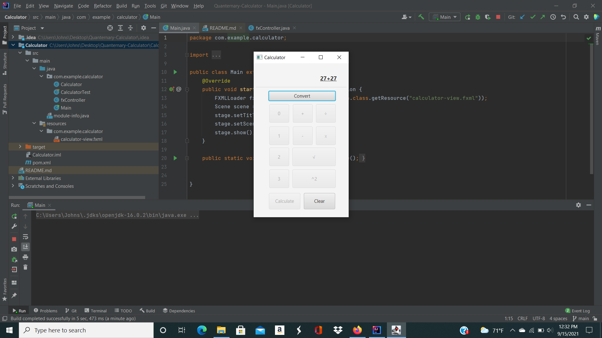
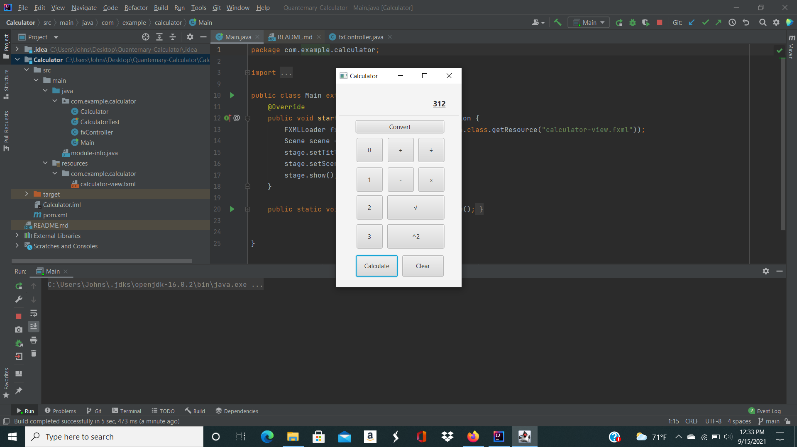

# Quaternary-Calculator

##Project Screenshots

###Initial startup of program:

###Entering quaternary values:

###Converting values to decimal:

###Result of the operation:

###Quaternary result converted to decimal:

##Project Manual

##Dependencies

##Task Distribution

###Matthew Johnson = Create Repository.
###Matthew Johnson = Set up .gitignore file.
###Matthew Johnson = Addition and subtraction functions work with quaternary numbers.
###Matthew Johnson = Implement addition and subtraction tests.
###Matthew Johnson = Implement UI number buttons, addition button, and subtraction button functionality.
###Matthew Johnson = Implement toggle button (particularly when converting with operations involved).

##Meetings
###Unfortunately due to varying class and work schedules, we were unable to meet for a full team meeting. We also did not meet up with parts of the group.
###While not being able to meet was an inconvenience, we did our best to keep continuous communication via the group chat created for this assignment in Slack. We would inform each other of what we were planning to work on, along with the progress each of us had made as we worked on different parts as to prevent multiple people from working on the same part (unless assistance was needed). 
